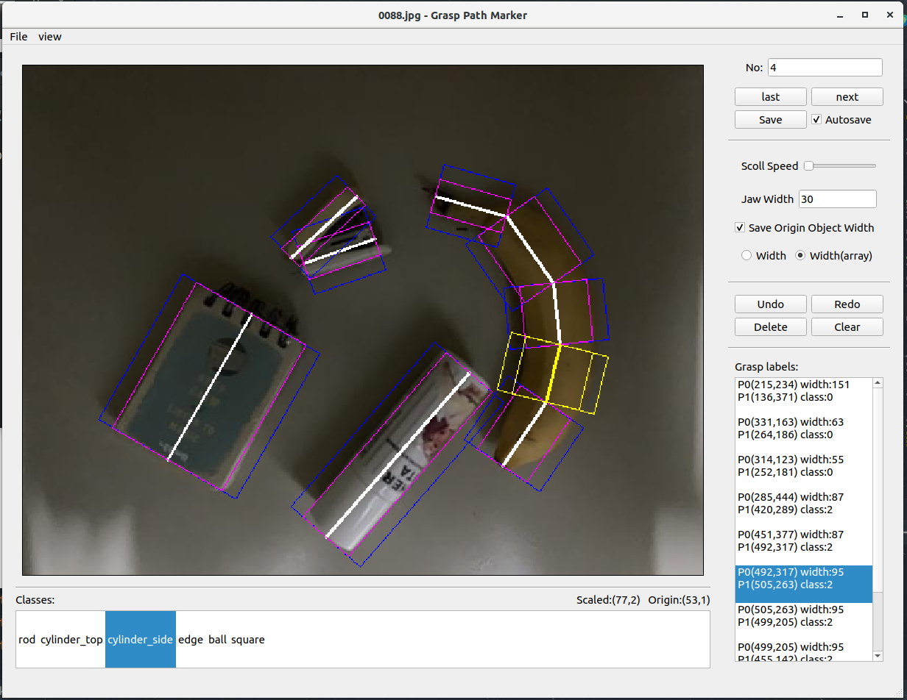
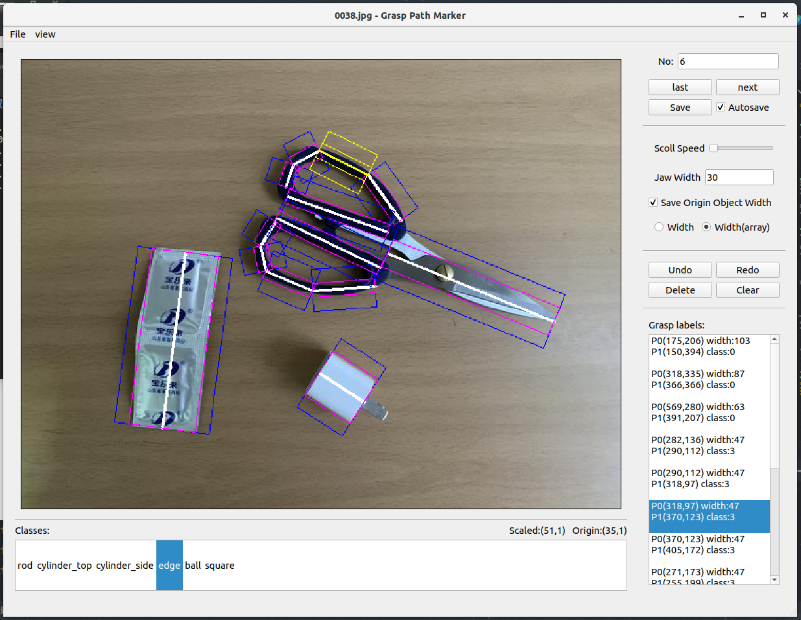

# grasp_path标注器


## 功能
读取图片文件夹并依次显示图片，使用鼠标标注抓取路径的路径点、宽度,以用于视觉抓取训练。  
标注结果将存入与图像同名的txt文件中。   
支持撤销、重做等操作。 

## 环境需求：
openCV, pyqt5

## 运行 
```
python glhf_gui.py  
```
如果提示
>could not load the Qt platform plugin "xcb" in "" even though it was found.

则执行
```
sudo apt-get install libxcb-xinerama0
```

## 使用
选择图像数据集路径、标注文件路径。   
选择标签（classes）文件路径。标签文件格式如class.txt   
即可开始标注。   
标注的数据保存在选定的标注文件路径中。   

## 操作与快捷键
左键点击标记下一个路径点，右键结束当前路径。  
ctrl+D 删除当前路径段  
ctrl+S 保存当前图片标注（可设置切换图片自动保存）  

[ 上一张图片   
] 下一张图片   
a d 改变滚轮速度   

q w e r t y u i o p 快速选择当前路径段的标签   
方向键←→ 选择当前选中路径段的标签   

方向键↑↓或点击右侧列表 选择路径段   


